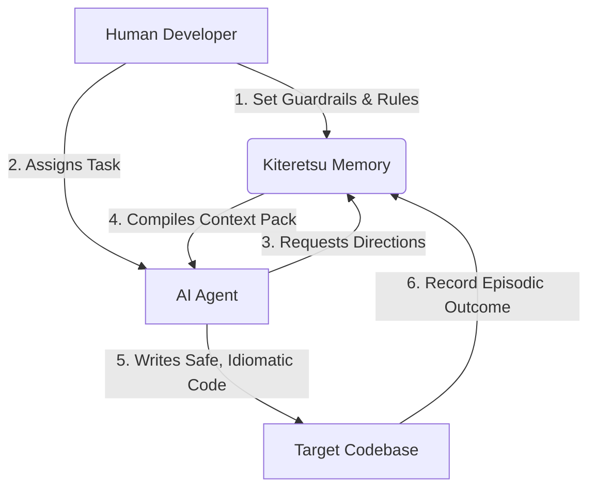

<div align="center">
  
  <h1>Kiteretsu</h1>
  <p><strong>The Cognitive Memory & Externalized Spatial Intelligence Layer for AI Coding Agents</strong></p>

  <p>
    <a href="https://github.com/spellsaif/kiteretsu/actions"></a>
    <a href="https://www.sqlite.org/wal.html"></a>
    <a href="https://tree-sitter.github.io/tree-sitter/"></a>
    <a href="https://modelcontextprotocol.io"></a>
  </p>

  <h4>"Stop letting AI agents blindly navigate your architecture. Give them the Encyclopedia."</h4>
</div>

---

## 🔮 The Philosophy

### 1. The Heritage of Invention
**Kiteretsu** (キテレツ) draws its name and spirit from the legendary anime *Kiteretsu Daihyakka*. In the story, the young inventor, Eiichi, is able to construct marvelous, advanced machines not through sheer guesswork or trial-and-error, but by referencing the **Kiteretsu Encyclopedia**—a multi-volume codex containing the designs, rules, and warnings of his genius ancestor. 

In modern software engineering, AI coding agents are incredibly gifted builders, but they are operating without an encyclopedia. When left to build blindly, even the most capable LLM wastes time recursively grepping directories, hallucinating structural dependencies, violating team idioms, and causing architectural decay. 

**Kiteretsu is the externalized Encyclopedia for your AI agents.** It provides a persistent, high-fidelity context compiler and memory layer, serving as the agent's spatial awareness.

### 2. Cognitive Offloading & Contextual Budgeting
Human brains manage complexity through spatial maps and contextual boundaries. AI agents, however, are forced to operate in narrow context windows. Blindly dumping a whole codebase into an LLM context creates noise, increases costs, and degrades generation quality. 

Kiteretsu solves this through **Spatial Intentionality**:
- **Cognitive Mapping**: By parsing the codebase into a high-fidelity directed dependency graph using Web-Tree-Sitter, Kiteretsu knows exactly where symbols begin, end, and flow.
- **Accretion & Pruning**: Instead of naive text chunking, Kiteretsu utilizes an optimized token-budgeting system (capping active code context at 8,000 tokens) to supply agents with the exact files they *must* read (`read_first`) while cleanly segregating downstream dependencies (`optional_read`).
- **Architectural Guardrails**: Humans set explicit, queryable governance rules (e.g., "Do not use axios; use native fetch"). The agent is dynamically served these constraints on-demand, preventing structural drift before a single line of code is written.

---

## ✨ Core Capabilities

*   ⚡ **WAL-Powered Graph Database**: Fully local, highly concurrent SQLite WAL database using Knex and native `sqlite-vec` extension for semantic embedding searches.
*   💥 **Blast Radius Calculation**: Instant dependency analysis traces imports across all directories, revealing exactly which files will be affected by a target code change.
*   🛡️ **Architectural Governance**: Seamlessly record and inject team-specific architectural rules directly into the agent's pre-computation loop.
*   📖 **Episodic Task Memory**: Record historical task successes and failures. When agents attempt similar features in the future, they learn from past engineering decisions.
*   🌐 **Multi-Language Fidelity**: Features native WASM-based tree-sitter grammars with ultra-resilient regex parser fallbacks for JS/TS, Python, Go, Rust, Ruby, C/C++, Java, Kotlin, Swift, and Scala.
*   🔌 **First-Class MCP Integration**: Natively serves as a Model Context Protocol (MCP) server, instantly plugging into Claude Code, Cursor, Antigravity, VS Code, and Aider.

---

## 🚀 Quick Start

Initialize Kiteretsu in your workspace or project root:

```bash
# 1. Install dependencies
pnpm add -w @kiteretsu/cli @kiteretsu/core

# 2. Initialize Kiteretsu directory and SQLite database
pnpm cli init

# 3. Perform the initial codebase parse and memory index
pnpm cli index
```

---

## 🛠️ The Agentic Workflow

Kiteretsu introduces a strict, secure feedback loop for AI agent interaction. Rather than letting agents run arbitrary terminal commands, enforce the **Kiteretsu Cycle**:



### Step 1: Human Sets the Guardrails
```bash
# Record an explicit architectural convention
pnpm cli record-rule "use-hono-router" "Use Hono router instead of raw express for routing. Hono is fully type-safe."
```

### Step 2: Agent Obtains the Context Map
The agent intercepts the user's task and immediately runs:
```bash
pnpm cli context "refactor cart routing"
```

**Kiteretsu's Response:**
```text
📦 Context Pack Compiled

Task: refactor cart routing

📁 Read First:
  - packages/server/src/routes/cart.ts
    Core structures: CartRouter. Key logic: initializeRoutes, getCart, updateCart.

💥 Blast Radius:
  ⚡ packages/server/src/App.ts (Will break if CartRouter exports change)
  ⚡ packages/core/test/routes.test.ts

🧪 Tests to Run:
  ✓ packages/core/test/routes.test.ts

📏 Rules to Follow:
  - use-hono-router: Use Hono router instead of raw express for routing. Hono is fully type-safe.
```

### Step 3: Agent Implements the Changes
The agent now has spatial awareness: it reads *only* `cart.ts` (saving massive context), modifies `App.ts` because it predicted the blast radius, uses Hono because of the rule, and knows exactly which test suite to run for verification.

### Step 4: Offload the Episodic Memory
Once verification succeeds, the agent records the outcome:
```bash
pnpm cli record-task "refactored cart routing to hono" success --notes "Hono transition completed. Speed increased by 14%."
```

---


## 🤖 Integration Protocol

To integrate Kiteretsu with your developer environment of choice, use the auto-integration CLI:

```bash
# Install integration rules and workflows for your platform
pnpm cli integrate cursor
pnpm cli integrate claude
pnpm cli integrate gemini
pnpm cli integrate antigravity
```

---

<div align="center">
  <p>Architected for the age of self-healing, agentic codebases.</p>
</div>
