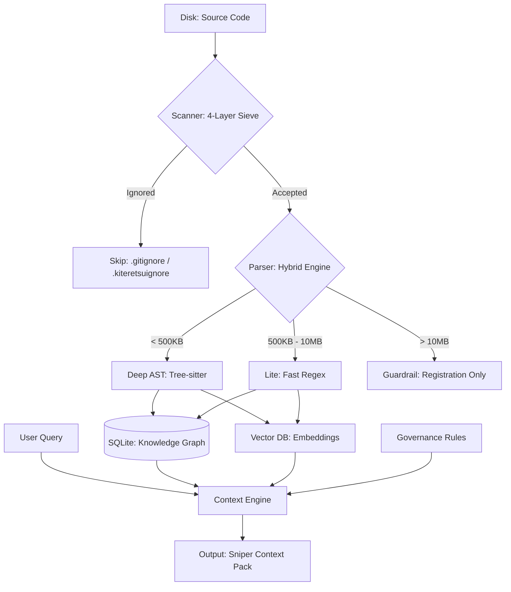
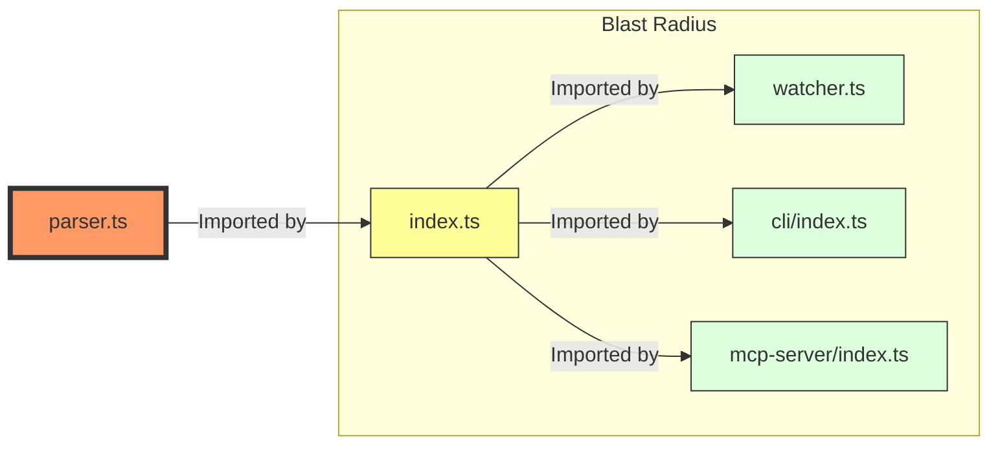

# Architecture Deep Dive

Kiteretsu is designed as a **High-Performance Hybrid Intelligence Pipeline**. Instead of treating your codebase as a flat collection of files, it treats it as a **Living Knowledge Graph**.

---

## 🛰️ The Intelligence Pipeline

---

## 💥 Transitive Blast Radius (The Ripple Effect)

Unlike standard search tools that only show direct imports, Kiteretsu calculates the **Transitive Impact**.

*In this example, changing **parser.ts** affects the entire chain, even though **watcher.ts** never imports it directly.*

---

## 🏗️ The 4-Stage Intelligence Pipeline

Kiteretsu processes your code through four distinct layers to ensure your AI agents get the perfect balance of speed and precision.

### 1. The Scanner (The Filter)
The scanner is the first line of defense against "Context Bloat." 
- **4-Layer Sieve**: It filters noise through the Global Blacklist, your `.kiteretsuignore`, machine-generated "garbage" (lockfiles), and physical size guardrails.
- **Size Awareness**: Files > 10MB are automatically skipped to protect system memory.
- **Standardized Governance**: All exclusions are managed via `.kiteretsuignore`, ensuring your index is clean from the start.

### 2. The Parser (The Hybrid Engine)
This is where the "translation" happens. Kiteretsu uses a **Hybrid Parsing Strategy**:
- **Deep AST (Tree-sitter)**: For files < 500KB, we use full Tree-sitter grammars to understand every class, function, and variable.
- **Lite Regex (High Speed)**: For files between 500KB and 10MB, we switch to a specialized Regex engine. This ensures we still capture **imports and exports** (for the Blast Radius) without the massive memory overhead of AST parsing.

### 3. The Knowledge Graph (The Memory)
All extracted data is stored in a local, sub-second SQLite database.
- **Transitive Mapping**: The graph doesn't just know who *you* import; it knows who imports *them*. This enables the **Transitive Blast Radius**.
- **Vector Embeddings**: Files are summarized and converted into high-dimensional vectors for semantic search.

### 4. The Context Engine (The Query)
When you run `kiteretsu context`, the engine performs a **Multi-Weighted Search**:
- **Semantic Similarity**: Finding conceptual matches using ONNX-powered embeddings.
- **Structural Significance**: Scoring files based on their position in the dependency graph.
- **Rule Injection**: Merging project-specific architectural rules into the final report.

---

## 🛡️ Stability & Safety
Kiteretsu is built to be **Crash-Proof** on Windows and in large Monorepos:
- **Zero-Manual Disposal**: We leverage V8's native garbage collection to avoid the "Zone" memory crashes common in WASM-heavy tools.
- **Atomic Polling**: The watcher uses a stable polling interval to avoid the file-locking issues (EBUSY) that plague traditional watchers on Windows.
- **Native finalization**: The CLI uses a graceful 300ms termination window to ensure all background AI threads finish cleanly.

---

## 💠 Why This Matters
By dissecting your project this way, Kiteretsu ensures that your AI Agent (Claude, Cursor, etc.) isn't just "guessing" where things are—it has access to the same architectural map that you do, but at the speed of light.
