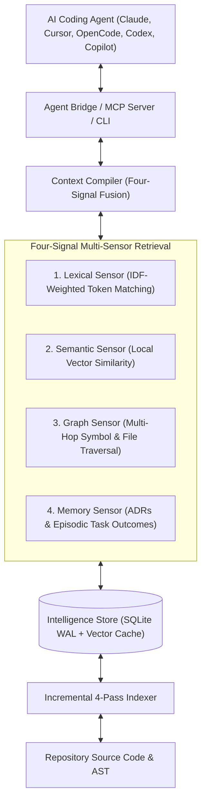
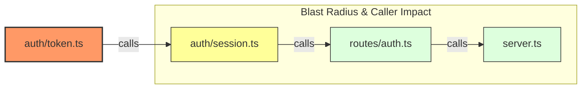

# Architecture Deep Dive

Kiteretsu is structured as an **Incremental Code Intelligence Engine & Agent Memory Layer**. Instead of treating a repository as flat text, it maintains a continuous **Semantic and Dependency Graph**.

---

## 🛰️ System Architecture

```mermaid
graph TD
    Agent["AI Coding Agent (Claude, Cursor, OpenCode, Codex, Copilot)"]
    Bridge["Agent Bridge / MCP Server / CLI"]
    Compiler["Context Compiler (Four-Signal Fusion)"]
    
    subgraph Sensors ["Four-Signal Multi-Sensor Retrieval"]
        S1["1. Lexical Sensor (IDF-Weighted Token Matching)"]
        S2["2. Semantic Sensor (Local Vector Similarity)"]
        S3["3. Graph Sensor (Multi-Hop Symbol & File Traversal)"]
        S4["4. Memory Sensor (ADRs & Episodic Task Outcomes)"]
    end

    Store[("Intelligence Store (SQLite WAL + Vector Cache)")]
    Indexer["Incremental 4-Pass Indexer"]
    Repo["Repository Source Code & AST"]

    Agent <--> Bridge
    Bridge <--> Compiler
    Compiler <--> Sensors
    Sensors <--> Store
    Store <--> Indexer
    Indexer <--> Repo
```

---

## 💥 Transitive Blast Radius (Downstream Ripple Effects)

Unlike basic search tools that only show immediate imports, Kiteretsu computes the full **Transitive Blast Radius**:

```mermaid
graph LR
    A["auth/token.ts"] -- "calls" --> B["auth/session.ts"]
    B -- "calls" --> C["routes/auth.ts"]
    C -- "calls" --> D["server.ts"]
    
    style A fill:#f96,stroke:#333,stroke-width:2px
    style B fill:#ff9,stroke:#333
    style C fill:#dfd,stroke:#333
    style D fill:#dfd,stroke:#333
    
    subgraph Blast Radius & Caller Impact
    B
    C
    D
    end
```

When an agent plans a modification to `auth/token.ts`, Kiteretsu surfaces:
- **Upstream Callers**: Direct and indirect consumers (`routes/auth.ts`, `server.ts`).
- **Affected Tests**: Conformance tests that exercise the modified symbols.
- **Risk Rating**: Computed `LOW`, `MEDIUM`, or `HIGH` based on centrality and fan-out.

---

## 🏗️ The 4-Stage Intelligence Pipeline

### 1. The Scanner (Sieve & Filtering)
The scanner is the first line of defense against noise and context bloat:
- **Multi-Layer Sieve**: Filters noise through global ignore lists (`node_modules`, `.git`), `kiteretsu.config.ts` `ignore` patterns, machine-generated files (lockfiles), and size thresholds.
- **Size Guardrails**: Files > 10MB are skipped from deep token indexing to preserve memory.

### 2. The Parser (AST & Symbol Extraction)
- **Deep AST (Tree-sitter)**: Extracts functions, classes, interfaces, methods, calls, extends, and imports.
- **Lightweight Path**: Large files use a lightweight parsing path that prioritizes structural information while avoiding excessive heap allocations.

### 3. The Graph & Memory Store (Persistent SQLite)
All symbols, file relations, architectural rules, decisions (ADRs), and episodic tasks are persisted in a high-performance local SQLite database (`.kiteretsu/memory/kiteretsu.sqlite`) using Write-Ahead Logging (WAL) mode for fast, concurrent reads.

### 4. The Context Compiler (Fusion & Budgeting)
When a task query is received (via CLI `kiteretsu context` or MCP `kiteretsu_context`):
1. Runs Lexical, Semantic, Graph, and Memory retrieval in parallel.
2. Applies Reciprocal Rank Fusion (RRF) with IDF weighting.
3. Formats an explainable Context Pack bounded by the agent's token budget.

---

## 🛡️ Stability & Resource Safety

- **Graceful Lifecycle Management**: Async finalization ensures worker threads and SQLite WAL locks release cleanly.
- **Incremental Indexing**: Four-pass reconciliation (Deleted Files -> Modified Diffs -> AST Parsing -> Embeddings) avoids re-indexing unchanged files.
- **Local Isolation**: All embeddings, graph indices, and episodic records remain strictly on your local machine.
